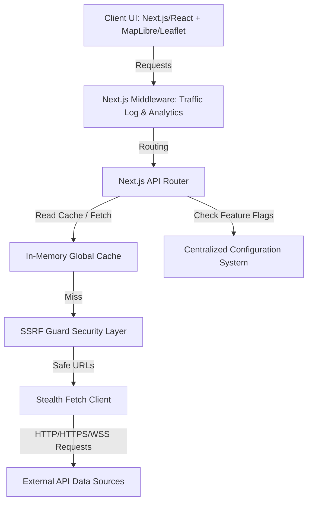

# ApexOS — Platform Architecture & Technical Analysis

This document provides a comprehensive technical analysis of the **ApexOS** platform, detailing its system architecture, data flow pipelines, caching strategies, security hardening, and extensible configuration system.

---

## 1. Platform Overview & Mission
**ApexOS** is a real-time, military-grade Open Source Intelligence (OSINT) and global situational awareness dashboard. It ingests, parses, aggregates, and visualizes live telemetry from multiple heterogeneous sources onto a unified geospatial visualization map. The platform monitors global commercial flights, maritime shipping traffic, active wildfires, earthquakes, space weather events, cyber threats, and live intelligence news feeds.

---

## 2. System Component Architecture
ApexOS is architected as a modern Next.js project with TypeScript, utilizing serverless-ready dynamic API routes, structured React components, and Leaflet/MapLibre GL for client-side geospatial map rendering.

---

## 3. Real-Time Ingestion & Data Flow Pipelines
The platform implements separate, decoupled pipelines for each intelligence layer to prevent slow data sources from blocking UI responsiveness:

*   **Commercial Flight Telemetry:** Ingests live aircraft transponder telemetry (ADS-B) from `adsb.lol` over active geographic regions.
*   **Maritime Vessel Tracking:** Subscribes to global AIS vessel telemetry via secure WebSocket connections to `aisstream.io` and maps active chokepoints (e.g., Strait of Hormuz, Bab el-Mandeb).
*   **Active Fire & Wildfire Ingestion:** Queries NASA FIRMS and NASA EONET services to parse thermal hotspot coordinates.
*   **Earthquake Analytics:** Pulls seismic events from the USGS earthquake feed and overlays magnitude and depth telemetry.
*   **Space Weather:** Reads NOAA SWPC telemetry (solar flares, geomagnetic storms).
*   **OSINT & Cyber Threat Intelligence:** Connects to vulnerability feeds (NVD CVE) and cyber threat RSS streams.

---

## 4. State Management & Cache Optimization
To avoid hitting third-party API rate limits and to prevent serverless execution timeouts, ApexOS leverages in-memory caching at the runtime boundary:
*   **Global Variables Cache:** Ingested datasets (such as flights and satellites) are cached in global scope variables (`globalThis` or local module cache).
*   **Coalescing Fetch Promises:** Concurrent client requests for flight data are coalesced to wait for the same active upstream fetch promise rather than spawning duplicate requests.
*   **CDN / Edge Cache Headers:** All GET endpoints return optimized `Cache-Control` headers (e.g., `public, s-maxage=30, stale-while-revalidate=60`) to allow edge nodes to serve cached responses.

---

## 5. Recon Toolkit & Active Sweep Engine
The platform includes a built-in OSINT Recon Toolkit (`src/app/api/osint/`) to perform passive and active target sweeps:
1.  **IP Intelligence:** Performs WHOIS lookup and geo-location resolution.
2.  **DNS & BGP Routing:** Resolves NS/MX records and queries BGP routing tables.
3.  **Vulnerability Scanner:** Queries NVD (National Vulnerability Database) CVE details for target tech stacks.
4.  **Stealth Port Scanner:** Spawns socket sweeps to test target ports safely from the server boundary.

---

## 6. Dockerization & Production Hardening
The containerization strategy has been hardened for production-grade deployments:
*   **Multi-Stage Build:** The build is divided into `deps` (dependency installation), `builder` (Next.js build execution), and `runner` (standalone production runner) stages.
*   **Standalone Next.js Output:** Leverages Next.js output standalone configuration to output only the minimal files required for production execution, discarding source files and devDependencies.
*   **Non-Root Privilege Execution:** Runs container processes under a custom non-root system user (`nextjs:nodejs` UID/GID 1001) to prevent privilege escalation.
*   **Extremely Small Size:** Optimized to compile down to just **279 MB** using Node 20 Alpine Linux base.

---

## 7. Security Architecture & SSRF Guard
A critical feature of the server boundary is protection against Server-Side Request Forgery (SSRF) and host header attacks:
*   **SSRF Guard (`src/lib/ssrf-guard.ts`):** Validates all user-input domains and target URLs against a blacklist of private/loopback/link-local IP addresses (e.g., `127.0.0.1`, `10.0.0.0/8`, `169.254.169.254`).
*   **Stealth Fetch Client (`src/lib/stealthFetch.ts`):** Standardizes user agents, enforces request timeouts, and encapsulates all outgoing requests to hide underlying server footprints.
*   **Security Headers:** Enforces strict headers including Content Security Policy (CSP), HTTP Strict Transport Security (HSTS), X-Frame-Options (SAMEORIGIN), and X-Content-Type-Options (nosniff) via `next.config.ts`.

---

## 8. Extensible Configuration System
ApexOS replaces all hardcoded metadata, endpoints, environment references, and flags with a centralized configuration system under `src/config/`:
*   **`branding.ts`:** Controls the platform title, description, domain, and repo links.
*   **`api-endpoints.ts`:** Holds all base URLs for third-party endpoints, ensuring zero hardcoded URLs in components.
*   **`env.ts`:** Provides a single, strongly-typed surface for accessing environment variables with safe defaults.
*   **`feature-flags.ts`:** Allows developers to toggle dashboard tabs and tools (e.g., flight tracker, ports sweep) at build or runtime.

---

## 9. Legal & MIT Compliance
ApexOS operates as an independent fork of the Osiris intelligence platform. In strict compliance with the MIT License:
*   The original copyright notice remains byte-for-byte identical in the `LICENSE` file.
*   A `NOTICE.md` file has been added in the project root to formally credit the original repository (`https://github.com/simplifaisoul/osiris`) and its creator.

---

## 10. Verification & Quality Assurance Suite
The codebase is validated via a rigorous local quality assurance checklist:
1.  **TypeScript Compilation:** Verified using `npx tsc --noEmit` with zero type errors.
2.  **Code Quality / Linting:** Checked via ESLint to ensure formatting and import consistency.
3.  **Build Verification:** Verified via `npm run build` completing with clean route logs.
4.  **Local Daemon Verification:** Container builds locally with `docker build` under size budgets.
