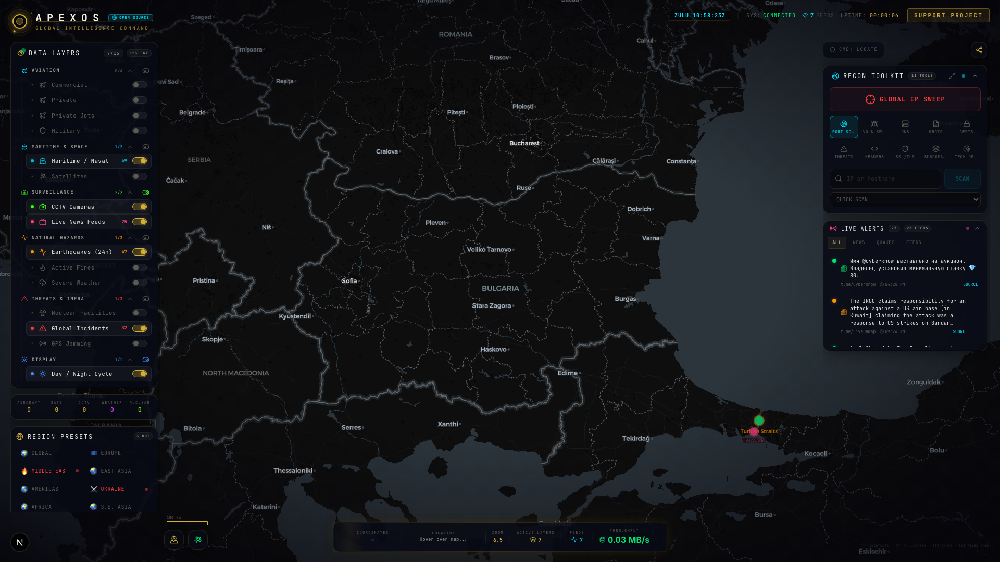
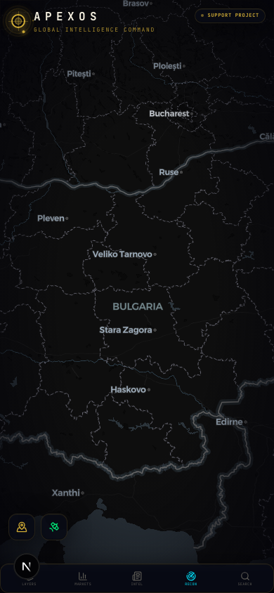
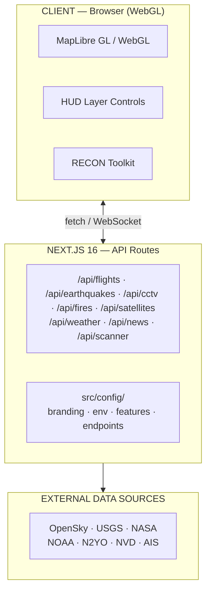

<div align="center">

# ⬡ ApexOS

### Real-Time Global Intelligence & OSINT Platform

[](https://github.com/Rexy-5097/apexos/actions/workflows/ci.yml)
[](https://github.com/Rexy-5097/apexos/blob/main/LICENSE)
[](https://nextjs.org)
[](https://typescriptlang.org)
[](https://github.com/Rexy-5097/apexos/blob/main/Dockerfile)
[](https://maplibre.org)

A real-time global intelligence dashboard that aggregates live flight tracking,
seismic activity, CCTV feeds, conflict zones, cyber threats, and 24/7 news
streams into a single GPU-accelerated OSINT interface.

[Live Demo]({{YOUR_DOMAIN}}) · [Report Bug](https://github.com/Rexy-5097/apexos/issues) · [Request Feature](https://github.com/Rexy-5097/apexos/issues)

</div>

---

## Screenshots

| Dashboard Overview | Flight Tracking Layer |
|---|---|
|  |  |

| Seismic Monitor | Mobile Responsive |
|---|---|
|  |  |

---

## Architecture



---

## Intelligence Layers

| Domain | Data Points | Source | Key Required |
|---|---|---|---|
| ✈️ Aviation | Commercial, private, military | OpenSky Network | Optional |
| 🌊 Maritime | 39 ports, 10 chokepoints | AISStream | Optional |
| 📹 CCTV | 2,000+ cameras | TfL, WSDOT, Caltrans, NYC DOT | No |
| 🌋 Seismic | Real-time M2.5+ global | USGS FDSN | No |
| 🔥 Fires | Active hotspots worldwide | NASA FIRMS | Optional |
| 📡 Satellites | Live orbital positions | N2YO | Optional |
| 🌩️ Weather | Severe global events | NASA EONET | No |
| ☀️ Space | Solar weather, CME alerts | NOAA SWPC | No |
| 🔓 Cyber | CVE threats, NVD feed | NIST NVD | No |
| ⚔️ Conflict | 13 active zones | Static OSINT | No |
| 📰 News | 25+ 24/7 live streams | Global broadcasters | No |

---

## RECON Toolkit

ApexOS includes a built-in active reconnaissance suite:

- **Port Scanner** — TCP connect scan with service fingerprinting
- **DNS Lookup** — Full record resolution (A, AAAA, MX, NS, TXT, CNAME)
- **WHOIS** — Domain and IP registration intelligence
- **SSL/TLS Inspector** — Certificate chain and expiry analysis
- **IP Intelligence** — Geolocation, ASN, and threat reputation
- **Vulnerability Scanner** — CVE correlation against NVD database

> The RECON toolkit requires a self-hosted scanner backend.
> Set `SCANNER_URL` and `SCANNER_KEY` in `.env` to activate.

---

## Quick Start

```bash
git clone https://github.com/Rexy-5097/apexos.git
cd apexos
cp .env.template .env
npm install
npm run dev
```

Open http://localhost:3000

---

## Docker

```bash
git clone https://github.com/Rexy-5097/apexos.git
cd apexos
cp .env.template .env
docker compose up -d
```

Open http://localhost:3000

Image: `node:20-alpine` multi-stage build · 279 MB · non-root UID 1001

---

## Environment Variables

| Variable | Required | Description |
|---|---|---|
| `PORT` | No | Host port mapping (default: 3000) |
| `SCANNER_URL` | RECON only | Scanner backend URL |
| `SCANNER_KEY` | RECON only | Shared secret (`openssl rand -hex 32`) |
| `OPENSKY_CLIENT_ID` | Optional | Higher flight data rate limits |
| `OPENSKY_CLIENT_SECRET` | Optional | Higher flight data rate limits |
| `FIRMS_API_KEY` | Optional | NASA fire hotspot data |
| `N2YO_API_KEY` | Optional | Live satellite tracking |
| `AIS_API_KEY` | Optional | Live maritime vessel tracking |

All layers except RECON function without any keys.

---

## Keyboard Shortcuts

| Key | Action |
|---|---|
| `F` | Toggle flight layer |
| `E` | Toggle earthquake layer |
| `S` | Toggle satellite layer |
| `D` | Toggle day/night cycle |
| `Esc` | Close active panel |

---

## Tech Stack

| Layer | Technology |
|---|---|
| Framework | Next.js 16 (App Router, Turbopack) |
| Language | TypeScript 5 |
| Map Engine | MapLibre GL JS (WebGL / GPU) |
| Animations | Framer Motion |
| Styling | Custom CSS Design System |
| Container | Docker (node:20-alpine, 279 MB) |
| CI | GitHub Actions |
| Deployment | Vercel Edge / Docker |

---

## Project Structure

```
apexos/
├── src/
│   ├── app/                  # Next.js App Router pages & API routes
│   │   └── api/              # Server-side data proxy routes
│   ├── components/           # React UI components
│   ├── config/               # Centralised configuration
│   │   ├── branding.ts       # Project identity constants
│   │   ├── api-endpoints.ts  # All external API URLs
│   │   ├── env.ts            # Typed environment variables
│   │   └── feature-flags.ts  # Layer and feature toggles
│   └── lib/                  # Shared utilities
├── public/                   # Static assets
├── docs/
│   ├── architecture/         # System design documents & diagrams
│   └── screenshots/          # Automated UI proof screenshots
├── .github/
│   ├── workflows/ci.yml      # GitHub Actions CI pipeline
│   └── ISSUE_TEMPLATE/       # Bug report & feature request templates
├── Dockerfile                # Multi-stage production build
├── docker-compose.yml        # Local orchestration
└── .env.template             # Environment variable reference
```

---

## Security

ApexOS proxies all external API requests server-side — no API keys are
ever exposed to the browser. The RECON toolkit endpoints are protected by
a shared secret and should be rate-limited before public deployment.

See [docs/architecture/SECURITY_MODEL.md](docs/architecture/SECURITY_MODEL.md)
for the full security model.

---

## Contributing

1. Fork the repository
2. Create a feature branch: `git checkout -b feat/your-feature`
3. Commit using conventional commits: `git commit -m "feat: add X layer"`
4. Open a Pull Request against `main`

See [.github/PULL_REQUEST_TEMPLATE.md](.github/PULL_REQUEST_TEMPLATE.md)
for the PR checklist.

---

## License

MIT — see [LICENSE](LICENSE) for details.

This project is a derivative work. See [NOTICE.md](NOTICE.md) for full
attribution.

---

<div align="center">
Built by <a href="https://github.com/Rexy-5097">Soumyadeb Tripathy</a>
</div>
