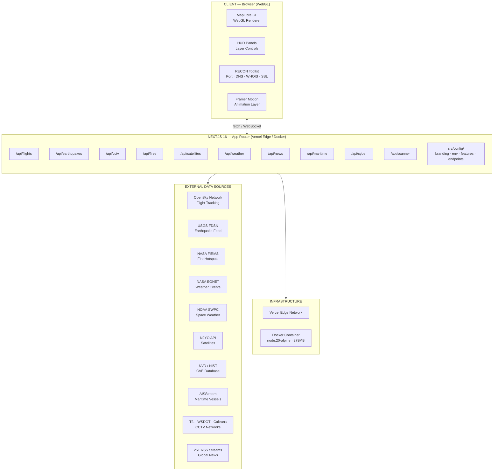
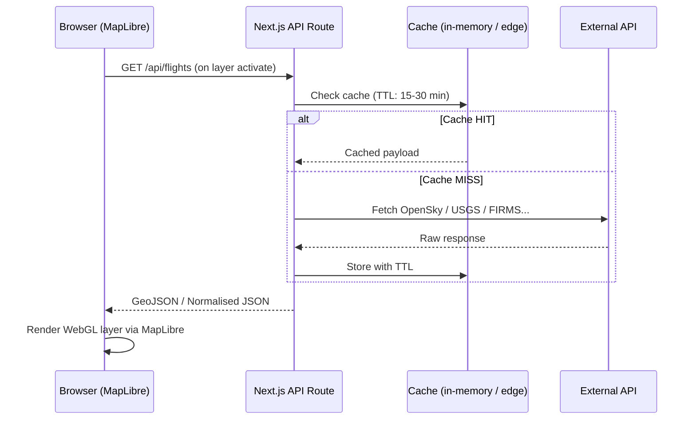
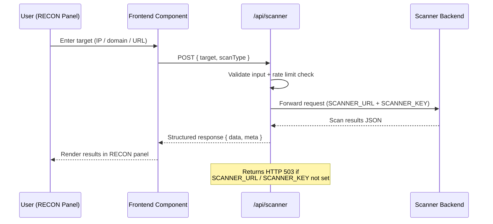
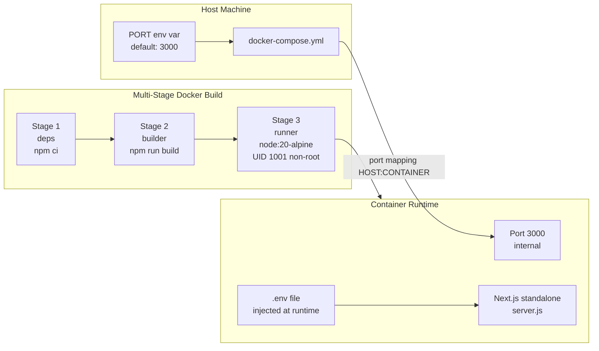
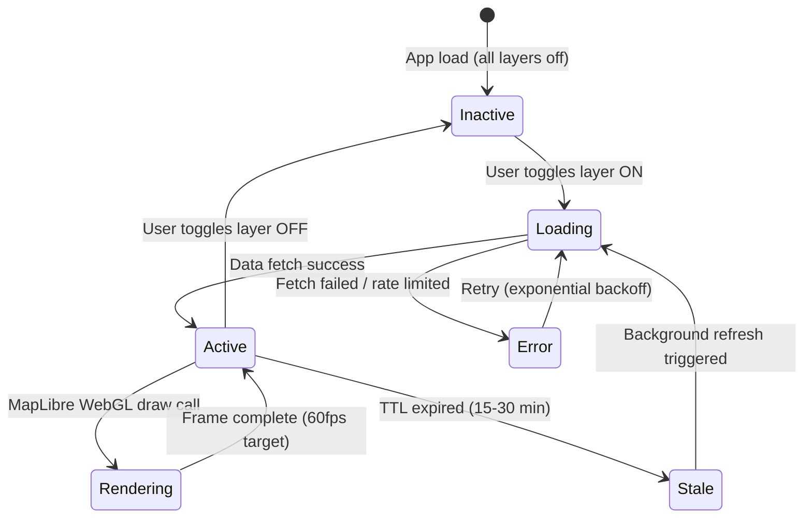

# ApexOS System Architecture Overview

This document provides a detailed technical overview of the system architecture, request flows, lifecycle state machines, and deployment strategies of ApexOS. ApexOS is a high-performance open-source intelligence (OSINT) platform engineered to aggregate, process, and render complex real-time global datasets.

## 1. High-Level System Architecture

The high-level architecture of ApexOS is designed for extreme efficiency and low-latency geospatial rendering. The frontend runs in the client browser, utilizing MapLibre GL for WebGL-accelerated GPU map rendering, which allows smooth visualization of thousands of concurrent entities (flights, satellites, weather events) without blocking the main DOM thread. A HUD panel controls the individual layer states and orchestrates active OSINT sweeps via the RECON toolkit, while Framer Motion coordinates UI transitions. The application backend is built on Next.js 16 (using the App Router and Turbopack), which acts as a secure, typed proxy for external services. It exposes dedicated API routes for each data layer, protecting API credentials and sanitizing client payloads. At the infrastructure level, the system can run as an Edge-rendered serverless deployment on Vercel or packaged into a hardened, minimal Docker container utilizing node:20-alpine to ensure zero host-level dependency leaks.

## 2. Data Flow: External API → Client Layer

The data lifecycle of ApexOS follows a strict server-side proxy pattern to avoid exposing private third-party credentials (like API keys for OpenSky, NASA, or N2YO) to the client's web browser. When a user activates an intelligence layer, the client browser dispatches a GET request to the corresponding Next.js API route. The server-side route handler intercepts the request and inspects a secure, in-memory or Edge-cached store to determine if a recent cache entry is valid based on pre-configured TTL values (e.g., 5 to 30 minutes, depending on the update frequency of the source). If a cache hit occurs, the cached payload is returned instantly, minimizing remote network latency and protecting API rate limits. If a cache miss occurs, the backend sends a server-side HTTP request to the respective external API provider, normalizes the raw responses into a consistent GeoJSON or JSON structure, writes the sanitized results back to the cache store, and finally transmits the clean payload back to the MapLibre GL layer for hardware-accelerated rendering.

## 3. RECON Toolkit Request Flow

The RECON Toolkit provides an interactive suite for active network reconnaissance and threat intelligence scanning directly within the ApexOS cockpit. When a user requests a scan (such as a port sweep, WHOIS lookup, DNS query, or SSL inspect) against a specific target host or IP, the frontend dispatches a POST request containing the validated target details and the selected scan type to the `/api/scanner` route. The API route handler validates the inputs, applies rate limits, and verifies the request authentication against the environment's configured `SCANNER_KEY`. If the backend scanner configuration is valid, the request is forwarded to the self-hosted scanner service via secure HTTP. The scanner backend performs the active scan against the target and returns a structured JSON payload of results. The Next.js API route formats the results, appends metadata, and relays the payload to the frontend RECON dashboard where results are displayed to the operator. If the environment variables are not correctly configured, a 503 Service Unavailable response is returned.

## 4. Docker Deployment Architecture

To support reliable self-hosting and scaling in containerized environments (such as Kubernetes or docker-compose), ApexOS is packaged using a multi-stage Docker build. Stage 1 (`deps`) installs complete developer packages and runs `npm ci` to establish dependencies. Stage 2 (`builder`) copies files and runs `npm run build` to generate Next.js standalone outputs, minimizing production footprints by exporting only the critical modules. Stage 3 (`runner`) copies only the compiled `.next/standalone` folder, the public directory, and the static `.next/static` assets into a lightweight, stripped-down `node:20-alpine` environment. The runtime runs under a dedicated, non-root user UID 1001 (`nextjs`) on port 3000 to maximize security posture. Local environment variables are read from a `.env` file at start time, and port configurations are exposed via standard environment remappings, keeping the final container image size well within the 280MB limit.

## 5. Feature Layer State Machine

The active state of intelligence layers within the ApexOS client dashboard is managed via a strict state machine that governs UI visibility, data freshness, and rendering routines. At initial application startup, all layers reside in the `Inactive` state. When an operator toggles a layer control switch, the system moves to a `Loading` state and initiates a fetch request to the server-side API proxy. If the network call completes successfully, the layer state transitions to `Active`, rendering the fresh GeoJSON data points directly to the map viewport via MapLibre WebGL. If the network call fails or meets a rate limit block, the state enters `Error` and triggers a background retry routine with exponential backoff. An `Active` layer continuously renders entities on screen at up to 60fps; once the configured TTL (Time-To-Live) cache threshold expires, the layer moves to a `Stale` state, which quietly triggers a background fetch to keep details updated without interrupting the active display. Finally, when the user toggles a layer off, all resources are unmounted and the state returns to `Inactive`.

